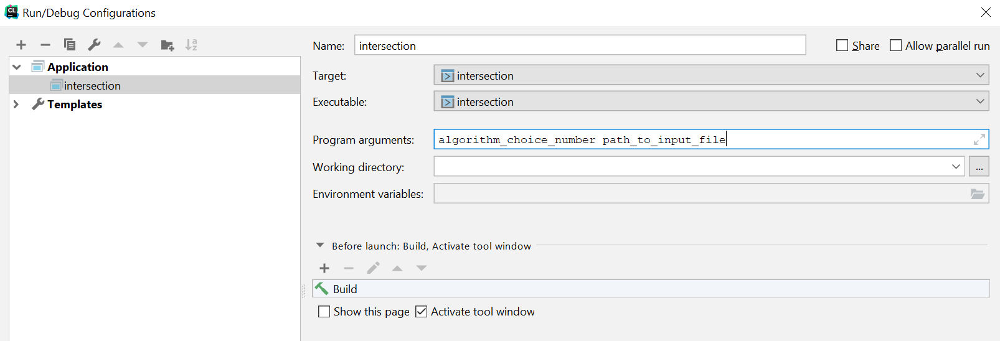
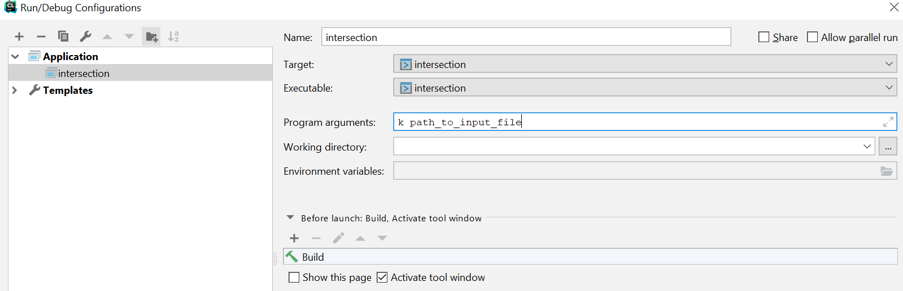
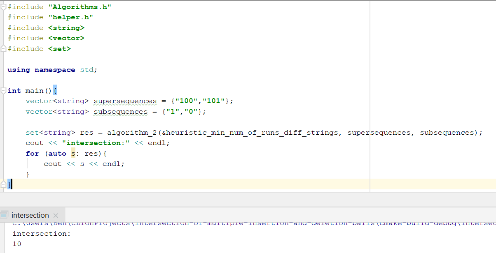

intersection-of-multiple-insertion-and-deletion-balls

This project provides algorithms for producing the intersection of multiple deletion and insertion balls.
Given k words of length n+t and k words of length n-t, the results are all words of length n that are subsequences of all long words and supersequences of all short words.
There are two algorithms:

###### Algorithm 1:
A naive approach for calculating the intersection.
Each word of length n+t is paired with a word of length n-t and the intersection of their t-deletion and t-insersion balls respectively is calculated. We then intersect the k sets and return the intersection as the result.

###### Algorithm 2:
A pair of words, one of length n+t and one of length n-t, are chosen according to some heuristic.
The intersection of their t-deletion and t-insertion balls respectively is calculated. The algorithm then proceeds with checking for every word in the intersection if it is a subsequence of all of the reamining long sequences and a supersequence of all remaining subsequences. Only words that satisfy all of these conditions is will be included in the output which contains the final result.
Different heuristics can be found in the helper.h file (functions whose name begins with "heuristic_") and can be provided by the user as well. We recommend using heuristic_min_num_of_runs_diff_strings which outperforms the rest.
It works as follows: the word of length n+t that is chosen is the one with the smallest number of runs. The word of length n-t that is chosen is the one with the largest number of runs. Ties are broken by the choosing the first word that satisfies the condition.

###### Base Algorithm
Both algorithms rely on the ability to calculate the intersection of a t-deletion ball of a word of length n+t and a t-insertion ball of a word of length n-t. This is done using the class CommonSequences whose algorithm is based on those presented in the paper ["The Intersection of Insertion and Deletion Balls"](https://ieeexplore.ieee.org/document/9611515)


### How to use the project:
In order to run either algorithms 1 or algorithm 2 (can be found in Algorithms.h file) you need to provide them with a vector of words of length n+t (supersequences) and a vector of words of length n-t (subsequences).
* For algorithm 1:
    * You need to provide also the number of sets of pairs to create and use from the sequences (if there are k supersequences and k subsequences you can provide any number between 1 and k. For the intersection of all of the relevant deletion and insertion balls provide k as the parameter value).
    * The implementation of algorithm 2 can be found in the Algorithms.cpp file and is named algorithm_1
* For algorithm 2:
    * You need to provide also a pointer to a function which will act as the heuristic. This function will choose a pair of strings, one from supersequences and one from subsequences. Examples can be found in the helper.cpp file (functions whose name begins with "heuristic_").
    * The implementation of algorithm 2 can be found in the Algorithms.cpp file and is named algorithm_2
    
The result of both algorithms is a set<string> object which is the set of all words in the intersection of the relevant deletion and insertion balls.


### How to run our tests:
There are two separate main files depending on the tests you would like to run:
To test the run-time of an algorithm use main_compare_algorithm_runtime.cpp.
To test the intersection size found using different heuristics for algorithm 2, use main_compare_heuristics.
Notice that the outputfiles will be found in the same folder as the exe file.


#### run-time testing:
  Test terminology and description:
  * A single test is comprised of a set of parameters (n, k, t), and two lists of strings:
      * n - target string length
      * k - number of supersequences/ subsequences
      * t - number of deletions/ insertions that are needed to create the target string from the supersequences/subsequences
      * list of the supersequences: contains k strings of length n + t
      * list of subsequences: contains k strings of length n - t
   * A batch of tests is num_of_tests consecutive single tests, all with the same (n, k, t) set.
   * The input file is used to run a series of test batches.

   **Input file:** 
   The testing file needs to be in the following structure: 
* first line - num_of_tests, the number of tests in a batch.
* second line - list containing the n-values of the batches. The values should be separated by spaces and listed in the order the batches appear in the file.
* third line - list containing the k-values of the batches. The values should be separated by spaces and listed in the order the batches appear in the file.
* fourth line - list containing the t-values of the batches. The values should be separated by spaces and listed in the order the batches appear in the file.
* from the fifth line onwards - 
   - For every batch:
      - num_of_tests lines, each line containing 2k strings seperated by spaces: k of length n + t followed by k of length n - t (where (n, k, t) are the parameters of this             batch).  

**Output file:**
A csv file with the average run time of each batch.

**Running the test:**
The two following parameters need to be provided as argc:
1. choice of algorithm
2. path to input file

choice of algorithm can take one of the following options:
* 1 - to test algorithm 1
* 21 - to test algorithm 2 with the heuristic function heuristic_random_pair
* 22 - to test algorithm 2 with the heuristic function heuristic_min_num_of_runs_diff_strings


If you are running the test on a linux machine, copy the files to the server and run the following command to compile the code:
```Bash
g++ -std=gnu++11 main_compare_algorithms_runtime.cpp Algorithms.cpp CommonSequences.cpp helper.cpp -o intersection
```
Now, run the following command to run the test: 
```Bash
./intersection algorithm_choice [path to input file]
```

If you are running the test through CLion the configuration should look like this:


In the python file input_file_generator.py you can use the function create_run_time_tests to create a test input file 


#### heuristic-testing:
The run time of algorithm 2 is very much dependant on the size of the initial intersection.
Therefore, we want a heuristic that provides a pair of strings with the smallest intersection possible.
This test is used to compare the intersection sizes of different heuristics.

Input parameters:
1. k - the number of supersequences/subsequences in each test in the test file
2. path to test file

**Input File:** The testing file should be in the following structure:
the first line in the test file is the number of single tests in the file
each subsequent line contains k supersequences of length n + t and k subsequences of length n - t, in that order (k is provided as a parameter outside of the input file). n, t need to be identical throughout the 2k sequences in a single line, but can differ between line to line.

**Output file:**
A csv file. Each line contains the following fields:
* n - the target length of words in the intersection
* t - number of insertions/deletions in the input words
* the ID size of the (supersequence, subsequence) pair chosen by the heuristic (from the appropriate line in the input file)

The heuristics compared in this test are as follows (more information on the heuristics can be found in the helper.h file)
1. optimal intersection size (find_pair_with_min_intersection_size) - although this can be passed as a heuristic function to algorithm 2, this is used as a performance base line to see how far from optimal the rest of the heuristics perform. Using this as an actual heuristic will take far more time to compute than the others.
2. max absolute difference of values of the max-length alternating subsequences of the provided sequences (heuristic_max_max_alternating_diff_strings)
3. min absolute difference of values of the max-length alternating subsequences of the provided sequences (heuristic_max_max_alternating_diff_strings)
4. random choice (heuristic_random_pair)
5. min distance of run-vectors of the sequences (heuristic_min_dist_run_vectors) - A run-vector of a string is a vector of integers who correspond to the lengths of the runs in the string in the order they appear
6. min difference of number of runs in a sequence (min_num_of_runs_diff_strings)


If you are running the test on a linux machine, copy the files to the server and run the following command to compile the code:
```Bash
g++ -std=gnu++11 main_compare_heuristics.cpp Algorithms.cpp CommonSequences.cpp helper.cpp test_heuristics.cpp -o intersection
```
Now, run the following command to run the test:
```Bash
./intersection k [path to input file]
```

If you are running the test through CLion the configuration should look like this:


In the python file input_file_generator.py you can use the function create_heuristic_tests to create a test input file 


### Getting Started and Using the Code
There are no special libraries needed to use any of the classes and files, Only standard cpp 11.
All you need to do is download the project

##### If you are using our tests:
* If you are testing the algorithms' run-times update the add_executable line in the cmakelists as follows:

```add_executable(intersection main_compare_algorithms_runtime.cpp CommonSequences.cpp Algorithms.cpp helper.cpp test_heuristics.cpp)```

* If you are testing the heuristics update the add_executable line in the cmakelists as follows:

```add_executable(intersection main_compare_heuristics.cpp CommonSequences.cpp Algorithms.cpp helper.cpp test_heuristics.cpp)```

##### If you already have a list of supersequences and subsequences and you wish to run one of our algorithms:
Firstly, save the lists in vectors of strings. Next, choose which algorithm you would like to use:
1. For algorithm 1 call the function algorithm_1 in the Algorithms.h file.
2. For algorithms 2 call the function algorithm_2 in the Algorithms.h file.
    * If you want to use any of our heuristics they can be found in the helper.h file.
    * If you wish to provide your own heuristic function:
        * The function receives two vectors of strings - supersequences and subsequences.
        * The function returns a vector of two iterators - the first is an iterator to chosen string in supersequences and the second is an iterator to the chosen string in subsequences 
    ```CPP
    //Signature of the function
    vector<vector<string>::iterator> heuristic_function_name(vector<string>& supersequences ,vector<string>& subsequences)
    ```
Example Code:

